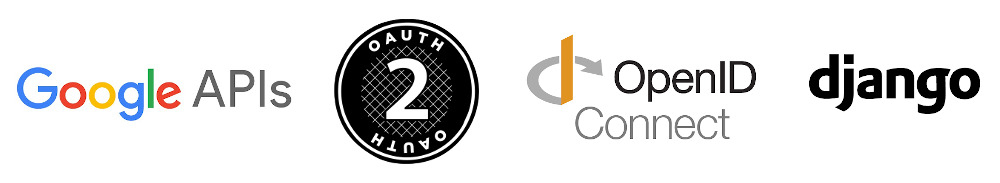
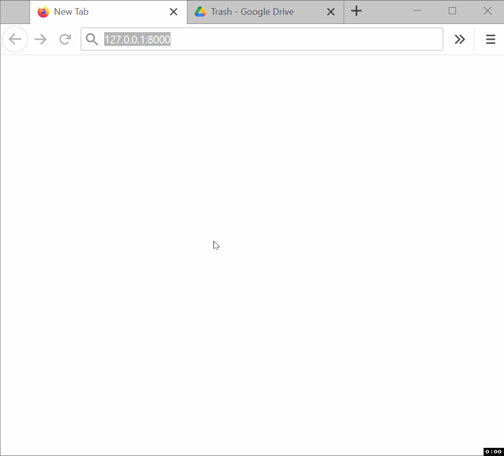

# Google OAuthLib Django

  

**Google OAuthLib Django** is a Django boilerplate app implementing a full Google OAuth2 authentication flow using [`google-auth-oauthlib`](https://github.com/googleapis/google-auth-library-python-oauthlib) with [Sessions](https://docs.djangoproject.com/en/3.1/topics/http/sessions/#using-sessions-in-views).

This is not intended as a replacement for Django's users sign up/in mechanism. [Django AllAuth](https://github.com/pennersr/django-allauth) is more suited for such use case. 

The App uses basic [Django Sessions](https://docs.djangoproject.com/en/3.1/topics/http/sessions/#using-sessions-in-views) to let users make authenticated requests that target their Google accounts’ resources. No user data is kept after logout.

## Table of Contents

- [Features](#features)
- [Compatibility](#compatibility)
- [Setup](#setup)
  - [Install and configure requirements](#install-and-configure-requirements)
  - [Option 1: Cloning and running the code from this repository](#option-1-cloning-and-running-the-code-from-this-repository)
  - [Option 2: Update an existing Django project/app](#option-2-update-an-existing-django-projectapp)
    - _[Add files](#-add-files)_
    - _[Modify files](#-modify-files)_

  

## Features

- Full OAuth2 authentication flow, with automatic access token refresh.
- Supporting two mechanisms:
    - Using a Google service API client library, [via](https://googleapis.github.io/google-api-python-client/docs/epy/googleapiclient.discovery-module.html#build) the Google API [Discovery](https://developers.google.com/discovery) resource constructor (`googleapiclient.discovery.build`).
    - Sending plain HTTP requests to a Google service API's endpoint, using a Bearer authentication scheme.
- Identifying users by parsing Open ID Connect (OIDC) ID tokens.
- Handling backend errors, warnings and infos, and storing their respective messages to the session key `messages`, which is added as a variable to template's context, and then rendered on the frontend.
- Handling access to some special paths like `/login` and `/auth`.
- `@require_auth` decorator for views.
- logout view function, that clears browser cookies along with the corresponding session from Django's database.

